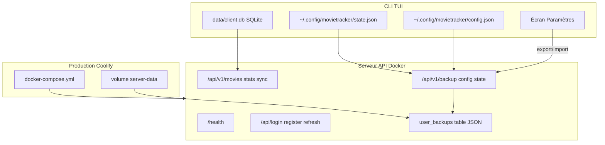

# Plan MovieTracker CLI — Suivi complet

> Cocher `[x]` au fur et à mesure. **Phases produit livrées : 0 → 10** — Application fonctionnelle.

**Dernière mise à jour** : 2026-07-08  
**Priorité actuelle** : [Grille de notation](#grille-de-notation--audit-et-plan-pour-la-note-maximale) — phases 11 → 17

**Progression produit** : `11 / 14` phases (0–10 + bonus A/B/C)  
**Progression grille** : `0 / 7` phases (11–17) · **Score estimé : ~11,5 / 20**

---

## Vue d'ensemble — toutes les phases

- [x] **Phase 0** — [Fondations](#phase-0--fondations) · P0 · Facile · ~2j
- [x] **Phase 1** — [Données locales](#phase-1--couche-données-locale) · P0 · Moyen · ~3j
- [x] **Phase 2** — [TUI navigation](#phase-2--tui--coquille-et-navigation) · P0 · Moyen-Difficile · ~4j
- [x] **Phase 3** — [CRUD films TUI](#phase-3--gestion-films-dans-la-tui) · P0 · Moyen · ~3j
- [x] **Phase 4** — [Recherche / filtres](#phase-4--recherche-et-filtres) · P1 · Moyen · ~2j
- [x] **Phase 5** — [Statistiques](#phase-5--statistiques) · P1 · Moyen · ~2j
- [x] **Phase 6** — [Auth serveur](#phase-6--authentification-serveur) · P0 · Moyen-Difficile · ~4j
- [x] **Phase 7** — [API REST](#phase-7--api-rest-films) · P0 · Moyen · ~3j
- [x] **Phase 8** — [Login TUI](#phase-8--connexion-tui--serveur) · P0 · Moyen · ~2j
- [x] **Phase 9** — [Sync hybride](#phase-9--sync-hybride) · P0 · Difficile · ~5j
- [x] **Phase 10** — [Polish](#phase-10--robustesse-et-polish) · P1 · Moyen · ~3j
- [ ] **Bonus A** — [TMDB](#bonus-a--intégration-tmdb) · P2 · Moyen · ~3j
- [ ] **Bonus B** — [Export CSV/JSON](#bonus-b--export-csv--json) · P3 · Facile · ~1j
- [ ] **Bonus C** — [Sync avancée](#bonus-c--améliorations-sync) · P3 · Difficile · ~3j

### Grille de notation ESGI (note maximale)

- [ ] **Phase 11** — [JSON XDG](#phase-11--conformité-stockage-json) · P0 · Facile · ~1j
- [ ] **Phase 12** — [Thèmes Lipgloss](#phase-12--thèmes-lipgloss-dynamiques) · P0 · Facile · ~0,5j
- [ ] **Phase 13** — [API backup serveur](#phase-13--backups-serveur-config--état) · P0 · Moyen · ~2j
- [ ] **Phase 14** — [TUI import/export](#phase-14--tui-importexport-dans-paramètres) · P0 · Facile · ~1j
- [ ] **Phase 15** — [Releases multi-OS](#phase-15--releases-multi-plateforme) · P0 · Moyen · ~1j
- [ ] **Phase 16** — [Déploiement Coolify](#phase-16--déploiement-production-docker--coolify) · P0 · Facile · ~1j
- [ ] **Phase 17** — [Soutenance](#phase-17--préparation-soutenance) · P0 · Facile · ~1j

---

## Stack technique (projet complet)

| Couche | Techno | Phase |
|--------|--------|-------|
| TUI | Bubble Tea + Bubbles + Lip Gloss | 2+ |
| HTTP API | chi + net/http | 6+ |
| SQLite | modernc.org/sqlite | 0+ |
| Migrations | goose | 0 |
| Auth | Argon2id + JWT | 6+ |
| Config YAML | `~/.movietracker/` | 8+ |

---

## Ordre de développement

```
0 → 1 → 2 → 3 → 4 → 5 → 6 → 7 → 8 → 9 → 10 → [A, B, C]
```

```bash
make build && make test
make run-cli
make run-server
```

---

## Phase 0 — Fondations

**Statut phase** : [ ] non commencée · [ ] en cours · [x] terminée  
**Priorité** : P0 | **Difficulté** : Facile | **Temps** : ~2 jours

**Objectif** : squelette compilable, conventions posées.

#### Tâches

- [x] Module Go `github.com/movietracker/movie-tracker`
- [x] Arborescence `cmd/`, `internal/` (+ migrations embarquées)
- [x] `Makefile` : build, test, run-cli, run-server
- [x] Migrations goose client (squelette) + serveur (table `users`)
- [x] `internal/domain` : `User`, `Movie`, `WatchEntry`
- [x] `internal/apperrors` : erreurs sentinel
- [x] `slog` dans les deux binaires
- [x] README minimal

#### Livrables

- [x] `go build ./...` passe
- [x] DB migrée au démarrage, logs visibles

#### Fichiers livrés

`go.mod`, `Makefile`, `README.md`, `.gitignore`, `cmd/`, `internal/apperrors/`, `internal/domain/`, `internal/database/`, `internal/logging/`

> Les migrations SQL sont embarquées dans `internal/database/migrations/` (source unique).

---

## Phase 1 — Couche données locale

**Statut phase** : [ ] non commencée · [ ] en cours · [x] terminée  
**Priorité** : P0 | **Difficulté** : Moyen | **Temps** : ~3 jours

**Objectif** : CRUD films en local sans TUI ni réseau.

#### Tâches

- [x] Repository SQLite : Create, GetByID, ListByUser, Update, Delete
- [x] Repository WatchEntry : note, critique, date, watched
- [x] Tests intégration `:memory:`
- [x] MovieService : validation titre, note
- [x] Erreurs ErrMovieNotFound, ErrDB wrappées

#### Livrables

- [x] Tests CRUD locaux ajoutés (`make test` à relancer avec Go installé dans l'environnement)

#### Fichiers livrés

`internal/repository/`, `internal/service/`, `internal/database/migrations/client/002_movies_watch_entries.sql`

---

## Phase 2 — TUI : coquille et navigation

**Statut phase** : [ ] non commencée · [ ] en cours · [x] terminée  
**Priorité** : P0 | **Difficulté** : Moyen-Difficile | **Temps** : ~4 jours

#### Tâches

- [x] Modèle Bubble Tea + routing écrans
- [x] Écrans : Splash, MainMenu, MovieList, MovieDetail, Stats, Settings, Login, Help
- [x] Bubbles : list, textinput, textarea
- [x] Lip Gloss : header, footer
- [x] État global : config, utilisateur

#### Livrables

- [x] Navigation clavier entre tous les écrans

#### Fichiers livrés

`internal/tui/`, `cmd/cli/main.go`

---

## Phase 3 — Gestion films dans la TUI

**Statut phase** : [ ] non commencée · [ ] en cours · [x] terminée  
**Priorité** : P0 | **Difficulté** : Moyen | **Temps** : ~3 jours

#### Tâches

- [x] Ajouter film (titre + année)
- [x] Liste avec statut vu/non vu
- [x] Détail : note, critique, date
- [x] Marquer vu + date YYYY-MM-DD
- [x] Note échelle 0–10
- [x] Critique texte
- [x] Messages d'erreur inline

#### Livrables

- [x] Cycle add → watch → rate → review en local

#### Fichiers livrés

`internal/tui/`, `cmd/cli/main.go`

---

## Phase 4 — Recherche et filtres

**Statut phase** : [ ] non commencée · [ ] en cours · [x] terminée  
**Priorité** : P1 | **Difficulté** : Moyen | **Temps** : ~2 jours

#### Tâches

- [x] Barre recherche TUI (LIKE titre)
- [x] Filtres : tous / vus / non vus / notés / sans note
- [x] Tri : titre, date, note
- [x] Repository Search avec MovieSearchParams
- [x] Mise à jour temps réel liste

#### Livrables

- [x] Recherche + filtres fonctionnels

#### Fichiers livrés

`internal/domain/`, `internal/repository/`, `internal/service/`, `internal/tui/`

---

## Phase 5 — Statistiques

**Statut phase** : [ ] non commencée · [ ] en cours · [x] terminée  
**Priorité** : P1 | **Difficulté** : Moyen | **Temps** : ~2 jours

#### Tâches

- [x] StatsService : totaux, moyenne, best/worst
- [x] Histogramme ASCII par mois
- [x] Écran TUI Stats

#### Livrables

- [x] Stats alimentées par la DB

#### Fichiers livrés

`internal/service/stats_service.go`, `internal/repository/stats_repository.go`, `internal/repository/stats_repository_test.go`, `internal/tui/view.go`, `internal/tui/model.go`, `cmd/cli/main.go`

---

## Phase 6 — Authentification serveur

**Statut phase** : [ ] non commencée · [ ] en cours · [x] terminée  
**Priorité** : P0 | **Difficulté** : Moyen-Difficile | **Temps** : ~4 jours

#### Tâches

- [x] Argon2id (`alexedwards/argon2id`)
- [x] POST register, login, refresh
- [x] Middleware JWT
- [x] Validation email + password min 8
- [x] Tests httptest
- [x] JWT_SECRET env, rate limiting

#### Hash Argon2id

- [x] HashPassword, ComparePassword, format PHC

#### Livrables

- [x] Register/login via curl

#### Fichiers livrés

`internal/auth/hash.go`, `internal/auth/token.go`, `internal/service/auth_service.go`, `internal/repository/user_repository.go`, `internal/server/handlers.go`, `internal/server/middleware.go`, `internal/server/context.go`, `internal/server/handlers_test.go`, `cmd/server/main.go`

---

## Phase 7 — API REST films

**Statut phase** : [ ] non commencée · [ ] en cours · [x] terminée  
**Priorité** : P0 | **Difficulté** : Moyen | **Temps** : ~3 jours

| Méthode | Route | Action | Statut |
|---------|-------|--------|--------|
| GET | /api/v1/movies | Liste | [x] |
| POST | /api/v1/movies | Créer | [x] |
| GET | /api/v1/movies/{id} | Détail | [x] |
| PUT | /api/v1/movies/{id} | Modifier | [x] |
| DELETE | /api/v1/movies/{id} | Supprimer | [x] |
| PUT | /api/v1/movies/{id}/watch | Watch | [x] |
| GET | /api/v1/stats | Stats | [x] |
| GET/POST | /api/v1/sync | Sync | [x] |

#### Tâches

- [x] Handlers CRUD films + recherche/filtres/tri (query params)
- [x] Handler watch (note, critique, date)
- [x] Handler stats
- [x] Handlers sync export/import
- [x] Isolation par utilisateur (JWT claims)
- [x] Tests httptest (`movie_handlers_test.go`)

#### Livrables

- [x] CRUD API authentifié

#### Fichiers livrés

`internal/server/server.go`, `internal/server/movie_handlers.go`, `internal/server/stats_handlers.go`, `internal/server/sync_handlers.go`, `internal/server/movie_handlers_test.go`, `internal/database/migrations/server/002_movies_watch_entries.sql`

---

## Phase 8 — Connexion TUI ↔ serveur

**Statut phase** : [ ] non commencée · [ ] en cours · [x] terminée  
**Priorité** : P0 | **Difficulté** : Moyen | **Temps** : ~2 jours

#### Tâches

- [x] Écrans Login + Register
- [x] AuthClient HTTP
- [x] Config ~/.movietracker/ (0600)
- [x] offline_mode

#### Livrables

- [x] Token persisté, reconnexion auto

---

## Phase 9 — Sync hybride

**Statut phase** : [ ] non commencée · [ ] en cours · [x] terminée  
**Priorité** : P0 | **Difficulté** : Difficile | **Temps** : ~5 jours

#### Tâches

- [x] sync_metadata, push/pull pending
- [x] Last-write-wins
- [x] Indicateur footer, sync S + 30s
- [x] Retry exponentiel

#### Livrables

- [x] Sync local ↔ serveur

---

## Phase 10 — Robustesse et polish

**Statut phase** : [ ] non commencée · [ ] en cours · [x] terminée  
**Priorité** : P1 | **Difficulté** : Moyen | **Temps** : ~3 jours

#### Tâches

- [x] Messages TUI FR centralisés
- [x] Écran aide complet
- [x] Tests E2E README
- [x] docker-compose, golangci-lint

#### Livrables

- [x] App production-ready

---

## Bonus A — TMDB · P2

- [ ] TMDB_API_KEY, client, endpoint search/external
- [ ] Recherche TUI à l'ajout
- [ ] Cache métadonnées

## Bonus B — Export · P3

- [ ] ExportService, JSON + CSV depuis Settings

## Bonus C — Sync avancée · P3

- [ ] Résolution conflits manuelle TUI
- [ ] Multi-appareils avancé

---

## Matrice récapitulative

| # | Feature | Priorité | Statut | Dépend de |
|---|---------|----------|--------|-----------|
| 0 | Fondations | P0 | [x] | — |
| 1 | SQLite local | P0 | [x] | 0 |
| 2 | TUI navigation | P0 | [x] | 0 |
| 3 | CRUD films TUI | P0 | [x] | 1, 2 |
| 4 | Recherche / filtres | P1 | [x] | 3 |
| 5 | Statistiques | P1 | [x] | 1, 2 |
| 6 | Auth serveur | P0 | [x] | 0 |
| 7 | API REST | P0 | [x] | 1, 6 |
| 8 | Login TUI | P0 | [x] | 2, 6 |
| 9 | Sync hybride | P0 | [x] | 7, 8 |
| 10 | Polish | P1 | [x] | 9 |
| A | TMDB | P2 | [ ] | 7, 3 |
| B | Export | P3 | [ ] | 1 |
| C | Sync avancée | P3 | [ ] | 9 |
| 11 | JSON XDG config + state | P0 | [ ] | 10 |
| 12 | Thèmes Lipgloss | P0 | [ ] | 11 |
| 13 | API backup serveur | P0 | [ ] | 11, 7 |
| 14 | TUI backup Paramètres | P0 | [ ] | 13, 12 |
| 15 | GoReleaser + Releases | P0 | [ ] | 10 |
| 16 | Déploiement Coolify | P0 | [ ] | 10 |
| 17 | Soutenance | P0 | [ ] | 11–16 |

---

## Prochaine étape

**Phase 11** — Conformité grille : `~/.config/movietracker/config.json` + `state.json`.  
Voir la [feuille de route complète](#grille-de-notation--audit-et-plan-pour-la-note-maximale).

> Les bonus A/B/C sont optionnels. Les phases 11–17 sont **obligatoires** pour viser la note maximale à la soutenance.

> Migrations : utiliser uniquement `internal/database/migrations/` (goose embed). Le dossier racine `migrations/` a été supprimé pour éviter la dérive.

---

# Grille de notation — Audit et plan pour la note maximale

> Objectif : couvrir **tous les critères** de la grille ESGI (CLI TUI, API REST, déploiement, soutenance).  
> **Score estimé actuel : ~11,5 / 16** (+ 4 pts soutenance à préparer).  
> **Score cible : ~20 / 20**.

**Progression grille** : `0 / 7` phases terminées (11 → 17)

---

## Mapping critères ESGI → phases

| Critère (1 pt chacun) | Phase(s) | Statut |
|------------------------|----------|--------|
| CLI TUI — mode TUI | — (Phase 2) | [x] fait |
| CLI TUI — écran d'accueil | — (Phase 2) | [x] fait |
| CLI TUI — authentification | — (Phase 8) | [x] fait |
| CLI TUI — paramètres (thème) | 12 | [ ] |
| CLI TUI — fonctionnalité principale | — (Phases 3–5) | [x] fait |
| CLI TUI — `config.json` dans `~/.config/` | 11 | [ ] |
| CLI TUI — `state.json` dans `~/.config/` | 11 | [ ] |
| CLI TUI — import/export config + état ↔ serveur | 13, 14 | [ ] |
| CLI TUI — UI agréable | 12 | [~] partiel |
| API — endpoints auth | — (Phase 6) | [x] fait |
| API — données application | — (Phase 7) | [x] fait |
| API — import/export config + état | 13 | [ ] |
| API — backups par utilisateur | 13 | [ ] |
| Cross-compile serveur Linux | 15, 16 | [~] partiel |
| Hébergement (Coolify / VPS Docker) | 16 | [ ] |
| Cross-compile CLI Win/Linux/macOS | 15 | [ ] |
| Releases GitHub | 15 | [ ] |
| Soutenance — questions techniques (4 pts) | 17 | [ ] |

---

## Vue d'ensemble — phases grille

- [ ] **Phase 11** — [Conformité stockage JSON](#phase-11--conformité-stockage-json) · P0 · Facile · ~1j
- [ ] **Phase 12** — [Thèmes Lipgloss dynamiques](#phase-12--thèmes-lipgloss-dynamiques) · P0 · Facile · ~0,5j
- [ ] **Phase 13** — [Backups serveur config + état](#phase-13--backups-serveur-config--état) · P0 · Moyen · ~2j
- [ ] **Phase 14** — [TUI import/export Paramètres](#phase-14--tui-importexport-dans-paramètres) · P0 · Facile · ~1j
- [ ] **Phase 15** — [Releases multi-plateforme](#phase-15--releases-multi-plateforme) · P0 · Moyen · ~1j
- [ ] **Phase 16** — [Déploiement Docker / Coolify](#phase-16--déploiement-production-docker--coolify) · P0 · Facile · ~1j
- [ ] **Phase 17** — [Préparation soutenance](#phase-17--préparation-soutenance) · P0 · Facile · ~1j

```bash
# Ordre recommandé
11 → 12 → 13 → 14 → 15 → 16 → 17
# La phase 15 peut démarrer en parallèle de 13–14
```

---

## Audit par critère (état au 2026-07-08)

### CLI en mode TUI (1 pt / critère)

| Critère | Statut | Note | Preuve / gap |
|---------|--------|------|--------------|
| Mode TUI | [x] | 1/1 | Bubble Tea + alt screen — `cmd/cli/main.go`, `internal/tui/` |
| Écran d'accueil | [x] | 1/1 | Splash → menu Films / Stats / Paramètres / Connexion / Aide |
| Authentification | [x] | 1/1 | Login + Register — `RouteLogin`, `RouteRegister` |
| Paramètres (thème) | [~] | ~0,5/1 | Écran OK ; couleurs Lipgloss **figées** dans `view.go` |
| Fonctionnalité principale | [x] | 1/1 | CRUD films, notes, stats, recherche/filtres |
| `config.json` dans `~/.config/` | [ ] | 0/1 | Actuel : `~/.movietracker/config.yaml` (YAML) |
| `state.json` dans `~/.config/` | [ ] | 0/1 | Pas de fichier d'état JSON (SQLite + `session.yaml`) |
| Import/export config + état ↔ serveur | [ ] | 0/1 | Sync films via `/api/v1/sync` seulement |
| UI agréable | [x] | ~1/1 | Lipgloss, footer dynamique, aide FR ; thèmes à activer |

**Sous-total CLI : ~6,5 / 9**

### Serveur d'API REST (1 pt / critère)

| Critère | Statut | Note | Preuve / gap |
|---------|--------|------|--------------|
| Endpoints d'authentification | [x] | 1/1 | register / login / refresh / me — `internal/server/handlers.go` |
| Données application | [x] | 1/1 | CRUD films, watch, stats — `internal/server/movie_handlers.go` |
| Import/export config + état client | [ ] | 0/1 | Pas d'endpoints dédiés backup config/état |
| Backups par utilisateur | [ ] | 0/1 | Isolation `user_id` en SQLite ; pas de snapshots |

**Sous-total API : 2 / 4**

### Déploiement et distribution (1 pt / critère)

| Critère | Statut | Note | Preuve / gap |
|---------|--------|------|--------------|
| Cross-compile serveur Linux | [~] | ~0,5/1 | `Dockerfile` CGO=0 ; pas de cible Makefile/GoReleaser |
| Hébergement (Coolify / VPS Docker) | [ ] | 0/1 | `docker-compose` local ; pas de doc prod Coolify |
| Cross-compile CLI Win/Linux/macOS | [ ] | 0/1 | Pas de GoReleaser |
| Releases GitHub | [ ] | 0/1 | Pas de tag, pas de workflow release |

**Sous-total déploiement : ~0,5 / 4**

### Soutenance

| Critère | Statut | Note |
|---------|--------|------|
| Questions techniques | [ ] | ?/4 — à préparer (`docs/SOUTENANCE.md`) |

---

## Architecture cible



---

## Phase 11 — Conformité stockage JSON

**Statut phase** : [ ] non commencée · [ ] en cours · [ ] terminée  
**Priorité** : P0 | **Difficulté** : Facile | **Temps** : ~1 jour  
**Critères visés** : `config.json` + `state.json` dans `~/.config/`

**Objectif** : aligner chemins et formats sur la grille (`~/.config/movietracker/config.json` + `state.json`).

#### Tâches

- [ ] Refactorer `internal/config/config.go` :
  - Chemin XDG : `filepath.Join(os.UserConfigDir(), "movietracker")`
  - Remplacer YAML par JSON (`encoding/json`)
  - Fichiers : `config.json`, `state.json`
- [ ] Définir le contenu de `state.json` :
  - `last_route`, filtres/tri actifs, `last_sync_at`, `sync_metadata`
  - Tokens JWT dans `session.json` séparé (ou documenter en soutenance)
- [ ] Migration douce : lire `~/.movietracker/*.yaml`, écrire les JSON, archiver l'ancien dossier
- [ ] Mettre à jour `README.md`, `docs/E2E.md`, tests `internal/config/`

#### Livrables

- [ ] `~/.config/movietracker/config.json` créé au premier lancement
- [ ] `~/.config/movietracker/state.json` persisté à la fermeture / changement d'écran
- [ ] Migration YAML → JSON transparente pour les utilisateurs existants

#### Fichiers impactés

`internal/config/config.go`, `internal/tui/routes.go`, `internal/tui/model.go`, `README.md`, `docs/E2E.md`

---

## Phase 12 — Thèmes Lipgloss dynamiques

**Statut phase** : [ ] non commencée · [ ] en cours · [ ] terminée  
**Priorité** : P0 | **Difficulté** : Facile | **Temps** : ~0,5 jour  
**Critère visé** : paramètres thème fonctionnel (couleurs qui changent)

**Objectif** : le champ thème dans Paramètres modifie réellement les couleurs de l'interface.

#### Tâches

- [ ] Créer `internal/tui/theme.go` : palettes `midnight`, `solar`, `forest`
- [ ] Remplacer les styles globaux figés de `view.go` par des styles dérivés du thème
- [ ] Recharger les styles à la sauvegarde (`saveSettings()` dans `model.go`)
- [ ] Sélecteur de thème par cycle (Tab) ou liste prédéfinie

#### Livrables

- [ ] Changer le thème dans Paramètres met à jour header, bordures, accents immédiatement

#### Fichiers impactés

`internal/tui/theme.go` (nouveau), `internal/tui/view.go`, `internal/tui/model.go`

---

## Phase 13 — Backups serveur config + état

**Statut phase** : [ ] non commencée · [ ] en cours · [ ] terminée  
**Priorité** : P0 | **Difficulté** : Moyen | **Temps** : ~2 jours  
**Critères visés** : import/export config+état + backups par utilisateur

**Objectif** : endpoints dédiés import/export config et état, stockage par utilisateur en base.

> SQLite suffit (JSON en TEXT). PostgreSQL JSONB cité dans la grille comme option, pas obligatoire.

#### Schéma

Migration `internal/database/migrations/server/003_user_backups.sql` :

```sql
CREATE TABLE user_backups (
  user_id    TEXT PRIMARY KEY REFERENCES users(id) ON DELETE CASCADE,
  config     TEXT NOT NULL DEFAULT '{}',
  state      TEXT NOT NULL DEFAULT '{}',
  updated_at TEXT NOT NULL
);
```

#### API

| Méthode | Route | Action |
|---------|-------|--------|
| GET | `/api/v1/backup/config` | Export config JSON utilisateur |
| PUT | `/api/v1/backup/config` | Import config |
| GET | `/api/v1/backup/state` | Export état JSON |
| PUT | `/api/v1/backup/state` | Import état |
| GET | `/api/v1/backup` | Snapshot complet `{config, state, synced_at}` |
| PUT | `/api/v1/backup` | Restauration complète |

#### Tâches

- [ ] Migration `003_user_backups.sql`
- [ ] `internal/repository/backup_repository.go`
- [ ] `internal/service/backup_service.go`
- [ ] `internal/server/backup_handlers.go` + tests httptest
- [ ] `internal/client/backup_client.go`
- [ ] Enregistrer les routes dans `internal/server/server.go`

> Conserver `/api/v1/sync` pour les films — la grille distingue données métier et config/état CLI.

#### Livrables

- [ ] Export/import config et état via curl ou client HTTP
- [ ] Un backup par `user_id`, isolé des autres utilisateurs

#### Fichiers impactés

`internal/database/migrations/server/003_user_backups.sql`, `internal/repository/backup_repository.go`, `internal/service/backup_service.go`, `internal/server/backup_handlers.go`, `internal/client/backup_client.go`, `internal/server/server.go`

---

## Phase 14 — TUI import/export dans Paramètres

**Statut phase** : [ ] non commencée · [ ] en cours · [ ] terminée  
**Priorité** : P0 | **Difficulté** : Facile | **Temps** : ~1 jour  
**Critère visé** : import/export config + état visible dans la TUI

**Objectif** : actions explicites pour le correcteur (pas seulement la sync auto des films).

#### Tâches

- [ ] Étendre l'écran Paramètres (`view.go`, `model.go`) :
  - `e` — Exporter config + état vers le serveur
  - `i` — Importer config + état depuis le serveur
  - `E` — Export local JSON (dossier config)
- [ ] Messages succès/erreur dans `internal/tui/messages/fr.go`
- [ ] Mettre à jour l'écran Aide (`help.go`)
- [ ] Tests navigation + commandes async

#### Livrables

- [ ] Import/export config+état démontrable en soutenance depuis Paramètres

#### Fichiers impactés

`internal/tui/model.go`, `internal/tui/view.go`, `internal/tui/help.go`, `internal/tui/messages/fr.go`, `internal/client/backup_client.go`

---

## Phase 15 — Releases multi-plateforme

**Statut phase** : [ ] non commencée · [ ] en cours · [ ] terminée  
**Priorité** : P0 | **Difficulté** : Moyen | **Temps** : ~1 jour  
**Critères visés** : cross-compile CLI (3 OS) + serveur Linux + GitHub Releases

**Objectif** : binaires multi-plateforme publiés automatiquement sur GitHub Releases.

#### Tâches

- [ ] Ajouter `.goreleaser.yml` :
  - `movietracker` : `windows/amd64`, `linux/amd64`, `linux/arm64`, `darwin/amd64`, `darwin/arm64`
  - `movietracker-server` : `linux/amd64` (VPS/Coolify)
  - `CGO_ENABLED=0`, `-ldflags -X .../internal/version.Version={{.Version}}`
- [ ] Workflow `.github/workflows/release.yml` sur tag `v*`
- [ ] Cibles Makefile : `build-linux`, `build-windows`, `build-darwin`, `release-snapshot`
- [ ] Section README « Installation » avec liens GitHub Releases
- [ ] Tag `v1.0.0` + première release (manuel post-merge)

#### Livrables

- [ ] Binaires Windows / Linux / macOS téléchargeables depuis GitHub Releases
- [ ] Binaire serveur Linux dans la release

#### Fichiers impactés

`.goreleaser.yml`, `.github/workflows/release.yml`, `Makefile`, `README.md`, `internal/version/version.go`

---

## Phase 16 — Déploiement production Docker / Coolify

**Statut phase** : [ ] non commencée · [ ] en cours · [ ] terminée  
**Priorité** : P0 | **Difficulté** : Facile | **Temps** : ~1 jour  
**Critère visé** : serveur hébergé (VPS + Coolify + Docker Compose)

**Objectif** : déploiement reproductible sur VPS via Coolify (pas Render/alwaysdata).

#### Tâches

- [ ] Renforcer `docker-compose.yml` pour prod :
  - Volume persistant pour `DB_PATH`
  - Support `PORT` en fallback dans `cmd/server/main.go` (si `PORT` défini et `ADDR` vide → `ADDR=:$PORT`)
- [ ] Ajouter `docs/DEPLOY.md` :
  - Prérequis VPS + Coolify
  - Variables : `JWT_SECRET` (32+ chars), `DB_PATH=/data/server.db`
  - Déploiement Git + Dockerfile ou docker-compose
  - Healthcheck `/health`, URL publique pour la CLI
  - Backup manuel du volume SQLite
- [ ] Optionnel : `docker-compose.prod.yml`
- [ ] Vérifier : `docker build --platform linux/amd64`

#### Livrables

- [ ] Serveur accessible publiquement depuis la CLI en production
- [ ] Guide de déploiement Coolify documenté

#### Fichiers impactés

`docker-compose.yml`, `cmd/server/main.go`, `docs/DEPLOY.md`, `docker-compose.prod.yml` (optionnel)

---

## Phase 17 — Préparation soutenance

**Statut phase** : [ ] non commencée · [ ] en cours · [ ] terminée  
**Priorité** : P0 | **Difficulté** : Facile | **Temps** : ~1 jour  
**Critère visé** : 4 pts questions techniques

**Objectif** : réponses structurées + démo live de 5 minutes.

#### Tâches

- [ ] Rédiger `docs/SOUTENANCE.md` avec réponses sur :
  1. Architecture (`cmd/` vs `internal/`, couches domain → repo → service)
  2. TUI Bubble Tea (routing, messages async `tea.Cmd`)
  3. Auth Argon2id + JWT + rate limiting
  4. Sync hybride push/pull, last-write-wins
  5. Stockage JSON XDG, SQLite, table `user_backups`
  6. Sécurité (permissions 0600/0700, isolation `user_id`)
  7. Build pure Go (`modernc.org/sqlite`), CGO=0, GoReleaser
  8. Déploiement Docker + Coolify + volume persistant
- [ ] Préparer scénario démo :
  1. CLI hors ligne → ajouter un film
  2. Connexion serveur Coolify → sync `S`
  3. Paramètres → thème → export/import backup
  4. Montrer `~/.config/movietracker/config.json` et `state.json`

#### Livrables

- [ ] Fiche soutenance prête
- [ ] Démo répétée une fois de bout en bout

#### Fichiers impactés

`docs/SOUTENANCE.md`

---

## Matrice récapitulative — grille

| # | Feature | Priorité | Statut | Dépend de | Critère grille |
|---|---------|----------|--------|-----------|----------------|
| 11 | JSON XDG config + state | P0 | [ ] | 10 | config.json + state.json |
| 12 | Thèmes Lipgloss | P0 | [ ] | 11 | Paramètres thème |
| 13 | API backup serveur | P0 | [ ] | 11, 7 | Import/export + backups user |
| 14 | TUI backup Paramètres | P0 | [ ] | 13, 12 | Import/export CLI |
| 15 | GoReleaser + Releases | P0 | [ ] | 10 | Cross-compile + GitHub |
| 16 | Déploiement Coolify | P0 | [ ] | 10 | Hébergement |
| 17 | Soutenance | P0 | [ ] | 11–16 | Questions techniques |

---

## Score cible après phases 11–17

| Bloc | Avant | Après |
|------|-------|-------|
| CLI TUI (9 critères) | ~6,5/9 | **9/9** |
| API REST (4 critères) | 2/4 | **4/4** |
| Déploiement (4 critères) | ~0,5/4 | **4/4** |
| Soutenance | ?/4 | **4/4** |
| **Total** | **~11,5/20** | **~20/20** |

---

## Prochaine étape (grille)

**Phase 11** — Migrer vers `~/.config/movietracker/config.json` + `state.json` (bloquant pour 4 critères).
